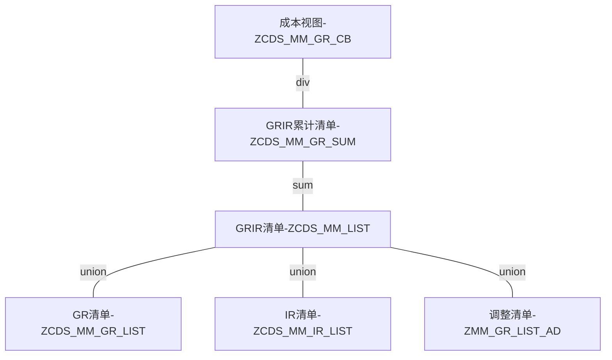

## 功能架构




### 1.ZCDS_MM_GR_LIST 采购入库清单

```ABAP
@AbapCatalog.sqlViewName: 'ZCDS_MM_GR_LIST'
@AbapCatalog。compiler。compareFilter: true
@AbapCatalog.preserveKey: true
@AccessControl.authorizationCheck: #NOT_REQUIRED
@EndUserText.label: '采购入库清单'
define view ZCDSV_MM_GR_LIST as select from matdoc
{
   key mandt，
   key cast( 'MKPF' as awtyp) as awtyp，
   key bukrs，
   key mblnr，
   key mjahr，
   key cast( zeile as docln6 ) as zeile， 
   budat，
   matnr，
   werks，
   lgort，
   shkzg，
   bwart，
   grund，
   case shkzg
   when 'H' then - erfmg
   when 'S' then erfmg
   end as ERFMG，
   case shkzg
   when 'H' then - dmbtr
   when 'S' then dmbtr
   end as DMBTR 
}
where 
( bwart = '101' 
或 bwart = '102' 
或 bwart = '561' 
或 bwart = '562' 
或 bwart = '161' 
或 bwart = '162')--只考虑采购入库单据和期初初始化
和 kzzug <> 'X' --排除UB单
和 kzvbr <> 'V' --排除消耗采购
和 matnr <> ''
```

### 2.ZCDS_MM_IR_LIST 发票校验成本调整清单

```ABAP
@AbapCatalog.sqlViewName: 'ZCDS_MM_IR_LIST'
@AbapCatalog.compiler。compareFilter: true
@AbapCatalog.preserveKey: true
@AccessControl.authorizationCheck: #NOT_REQUIRED
@EndUserText.label: '发票校验成本调整清单'
define view ZCDSV_MM_IR_LIST as select from acdoca
{
   key rclnt as mandt,
   key awtyp,
   key rbukrs as bukrs,
   key belnr as mblnr,
   key gjahr as mjahr,
   key docln as zeile, 
   budat as budat,
   matnr,
   werks as werks,
   cast ('' as lgort_d ) as lgort,
   drcrk as shkzg,
   cast ('' as bwart ) as bwart,
   cast( '' as mb_grbew ) as grund,
   cast( 0 as menge_d ) as ERFMG,
   wsl as DMBTR
}
where 
(  awtyp = 'PRCHG'--MR21调价凭证
or awtyp = 'RMRP'--发票校验
或 ( awtyp = 'MKPF' and blart = 'PR' ) --前期冲销导致的差异
)
and matnr <> ''
和 ( ktosl = 'BSX' or ktosl = 'PRD' )
```

### 3.ZCDS_MM_LIST 成本变动凭证清单

```ABAP
@AbapCatalog.sqlViewName: 'ZCDS_MM_LIST'
@AbapCatalog.compiler。compareFilter: true
@AbapCatalog.preserveKey: true
@AccessControl.authorizationCheck: #NOT_REQUIRED
@EndUserText.label: '成本变动凭证清单'
define view zcdsv_mm_grir_list as 
 
select from zcds_mm_gr_list
{
key mandt,
key awtyp,
key bukrs,
key mblnr,
key mjahr,
key zeile,
budat,
matnr,
werks,
lgort,
shkzg,
bwart,
grund,
erfmg,
dmbtr
}
union all
select from zcds_mm_ir_list
{
key mandt,
key awtyp,
key bukrs,
key mblnr,
key mjahr,
key zeile,
budat,
matnr,
werks,
lgort,
shkzg,
bwart,
grund,
erfmg,
dmbtr
}
union all
select from zmm_gr_list_ad
{
key mandt,
key awtyp,
key bukrs,
key mblnr,
key mjahr,
key zeile,
budat,
matnr,
werks,
lgort,
shkzg,
bwart,
grund,
erfmg,
dmbtr
}

```

### 4.ZCDS_MM_GRIR_SUM 合计GRIR的数量金额

```ABAP
@AbapCatalog.sqlViewName: 'ZCDS_MM_GRIR_SUM'
@AbapCatalog.compiler。compareFilter: true
@AbapCatalog.preserveKey: true
@AccessControl.authorizationCheck: #NOT_REQUIRED
@EndUserText.label: '合计GRIR的数量金额'
define view ZCDSV_MM_GRIR_SUM
  with parameters
    P_endDate  : vdm_v_end_date
as select from zcdsv_mm_grir_list
{
 mandt,
 matnr,
 werks, 
 @EndUserText.label: '累计入库数量'
 sum( erfmg ) as menge,
 @EndUserText.label: '累计入库金额'
 sum( dmbtr ) as AMOUNT
}
where budat <= :P_endDate
group by mandt,matnr,werks

```

### 5.ZCDS_MM_GRIR_CB 累计入库成本计算

```ABAP
@AbapCatalog.sqlViewName: 'ZCDS_MM_GRIR_CB'
@AbapCatalog.compiler。compareFilter: true
@AbapCatalog.preserveKey: true
@AccessControl.authorizationCheck: #NOT_REQUIRED
@EndUserText.label: '累计入库成本计算'
define view ZCDSV_MM_GRIR_CB 
  with parameters
 @EndUserText.label: '截至日期'
    P_endDate  : vdm_v_end_date
as select from mbew as M
left outer join ZCDSV_MM_GRIR_SUM(P_endDate: :P_endDate) as G 
on M.mandt = G.mandt 和 M.matnr = G.matnr 和 M.bwkey = G.werks
{ 
 key M.mandt，
 key M.matnr，
 key M.bwkey，
 @EndUserText.label: '累计入库数量'
 G.menge，
 @EndUserText.label: '累计入库金额'
 G.AMOUNT，
 @EndUserText。label: '入库移动平均成本'
 case 
 when ( G.menge is null 或 G.menge = 0 ) then M.verpr
 else division( G.AMOUNT, G.menge ， 2 )
 end as PRICE
}
```

